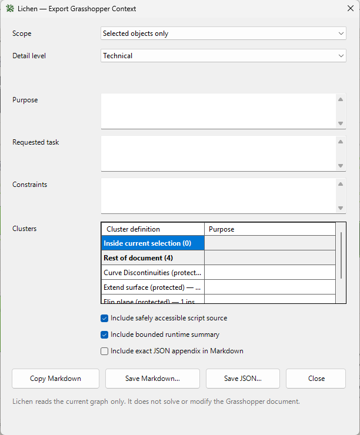

# Lichen

Lichen is a local-first, read-only Grasshopper plugin that turns a selected part of a definition—or a persistent Lichen Export Root—into deterministic Markdown and JSON for documentation, troubleshooting, and handoff to a coding agent.

Lichen is designed to fit into the Grasshopper workflow you already know. You continue to create and revise the definition in Grasshopper, choose what context to share, and decide whether and how to apply any response. Lichen does not give an AI control of the canvas or send anything automatically.

Developed by Yibin Yang at Adrian Smith + Gordon Gill Architecture (AS+GG).

## Lichen in Grasshopper


<p align="center">
  
</p>

## Requirements

- Rhino 8.30 or later for Windows
- Grasshopper 1

## Installation

1. In Rhino, run `PackageManager`.
2. Search for **LichenGH** and select **Install**. The installed Grasshopper plugin and component are named **Lichen**.
3. Restart Rhino if prompted, then open Grasshopper.

## Use

1. Select the Grasshopper components you want help understanding, troubleshooting, documenting, or developing further.
2. Choose **Lichen → Copy Context…** and click **Copy Markdown**.
3. Paste the Markdown into the coding agent or chat of your choice together with your question or request.

For a persistent scope, place the **Lichen** component at the end of a workflow. Connect a result to X for an inferred upstream closure, or connect one or more outermost Thallus boundary outputs to T for exact author-defined workflow membership; X and T are mutually exclusive on one Lichen component. Outermost Thallus identities can connect directly or pass through native Merge, Jitter's Values path, and Relay, with the validated runtime order preserved in export. Create a Thallus by selecting components and choosing the native-style **Create Thallus** companion in the empty left slot of Grasshopper's middle-click radial menu. The T port appears directly on the outermost Thallus boundary, while nested Thalli do not expose an independent output. Thalli can store a description and key/value properties, and selecting a Thallus alone is sufficient for selection-based export through the top Lichen menu.

Lichen supports selected-only, immediate-upstream, all-upstream, entire-document, and persistent Export Root scopes. Brief, Technical, and Exact detail levels range from a concise workflow handoff to a complete JSON-backed graph representation. Technical output disambiguates colliding cluster and port labels and reports bounded, already-computed data-tree paths when they carry useful topology. Every export includes a deterministic Lichen provenance seal, and the dialog reports exact Markdown and JSON character and UTF-8 byte sizes. The Exact JSON contract is documented in [`docs/context-schema.md`](docs/context-schema.md).

## Privacy and behavior

Lichen runs locally. It does not serialize full geometry, access the network, call an AI model, send telemetry, alter wires or component states during export, or force a Grasshopper solution. Capture, highlighting, and export remain read-only. The explicitly invoked **Select chain** command changes selection only; the explicitly invoked **Create Thallus** and Thallus editing commands add or edit their scoped Lichen document objects with Grasshopper undo records. Password-protected clusters remain opaque, and safely accessible C# and Python source is read without executing or compiling it.

## Build

Requirements:

- Windows with Rhino 8.30 or later installed in the standard location
- .NET Framework 4.8 runtime/build tools

From PowerShell in the repository root:

```powershell
.\build.ps1
```

The build compiles the plugin, runs the host-free automated test suite, validates package contents and versions, and creates manual-install and Rhino Package Manager artifacts under the ignored `artifacts` directory. It does not launch Rhino or Grasshopper.

The public source tree contains:

```text
src/                 Plugin, core graph model, and Grasshopper adapters
tests/Lichen.Tests/  Deterministic host-free test runner
packaging/yak/       Rhino Package Manager metadata
docs/                Installation and Exact JSON schema documentation
```

## License

Lichen is available under the [MIT License](LICENSE).
